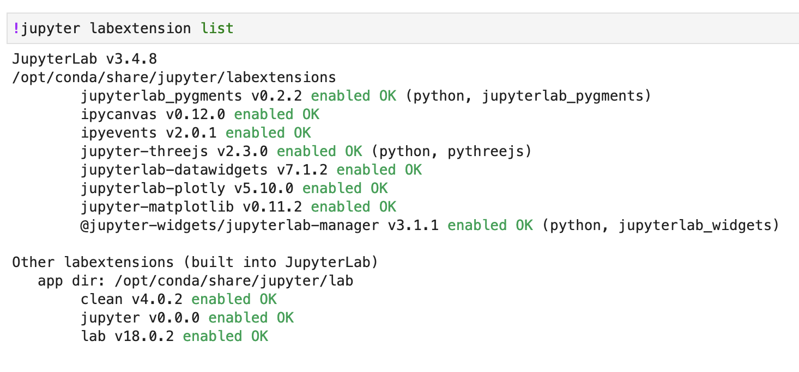

# cytodata-3d-shape-analysis

Notebook and resources for Cytodata 2022 "Shape Analysis in 3D" workshop. 

## Set up 
For running on your own machine, you need to install dependencies in `requirements.txt` e.g. `pip install -r requirements.txt`

You also need the following labextensions in your Jupyter environment:

